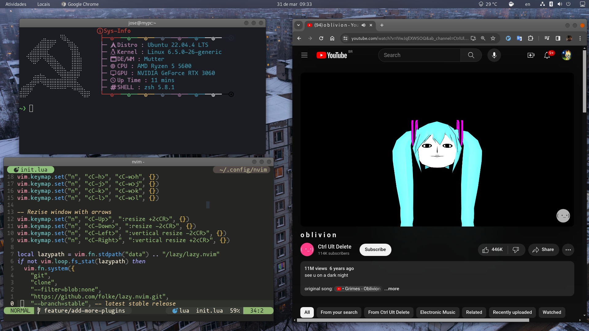

<h1 align="center">🦚Zeh’s dotfiles🦩</h1>

   <!--                          BLUE LABELS                                                   -->
   
   
   
   
   
   <!--                          GREEN LABELS                                                  -->
   
   
   
   
   
   <!--                          PURPLE LABELS                                                 -->
   
   
   
   
   
   <!--                          MISC LABELS                                                 -->
   
   
   

## 🧣My personal linux desktop configuration
place where I store and organize my unix-shell configurations

## 🦠 Required dependecies

    

     <a href="https://github.com/tmux/tmux"> TMUX</a>
     <a href="https://github.com/ohmyzsh/ohmyzsh"> OHMYZSH</a>
     <a href="https://github.com/ajeetdsouza/zoxide?tab=readme-ov-file#installation"> ZOXIDE</a>
     <a href="https://github.com/alacritty/alacritty"> ALACRITTY</a>
     <a href="https://sw.kovidgoyal.net/kitty/binary"> KITTY</a>
    

## 📺 Desktop Sample

