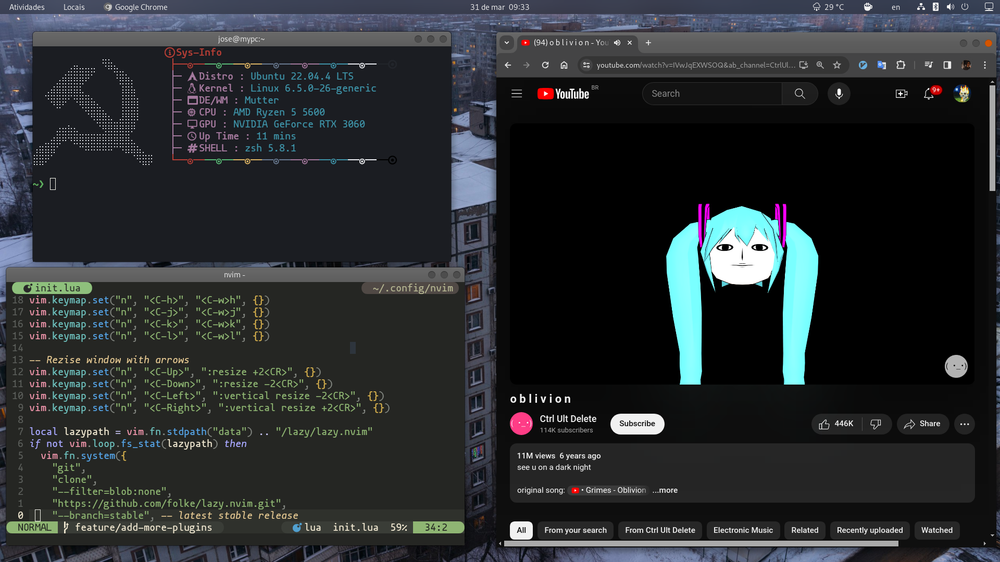

<h1 align="center">🦚Zeh’s dotfiles🦩</h1>
<p align="center">
<div style="display:flex; justify-content:center; flex-direction:row; flex-wrap:wrap;">
   <!--                          BLUE LABELS                                                   -->
   
   
   
   
   
   <!--                          GREEN LABELS                                                  -->
   
   
   
   
   
   <!--                          PURPLE LABELS                                                 -->
   
   
   
   
   
   <!--                          MISC LABELS                                                 -->
   
   
   
   
   

</div>
</p>
<p align="center">place where I store my poorly organized configurations</p>



<!-- ## details -->
<!--   -->
<!-- > **OS:** &nbsp;   -->
<!-- > **WM / DE:** &nbsp;   -->
<!-- > **Shell:** &nbsp;   -->
<!-- > **Terminal:** &nbsp;   -->
<!-- > **Editor:** &nbsp;   -->
<!-- > **Bar:** &nbsp;   -->
<!-- > **Launcher:** &nbsp;   -->
<!-- > **Font:** &nbsp;   -->
<!-- > **Theme:** &nbsp;   -->
<!-- > **Icons:** &nbsp; -->
 

## Stow structure

Each top-level directory is a **stow package**. Its contents mirror your `$HOME`, so stow knows exactly where to symlink everything.
 
```
~/.dotfiles/
├── bash/
│   └── .bashrc
├── zsh/
│   └── .zshrc
├── git/
│   └── .gitconfig
├── nvim/
│   └── .config/nvim/
├── tmux/
│   └── .tmux.conf
└── ...
```
 
 


Install stow:
 
```bash
# debian
sudo apt install stow

# nix
nix shell -p stow
 
# macOS (Homebrew)
brew install stow
```
 

## setup with stow
 
**1. Clone the repo**
 
```bash
git clone https://github.com/yourusername/dotfiles.git ~/.dotfiles
cd ~/.dotfiles
```
 
**2. Back up any existing configs you care about**
 
```bash
# example — do this for any file that already exists
mv ~/.bashrc ~/.bashrc.bak
```
 
**3. Stow a package**
 
```bash
stow bash        # links bash/.bashrc → ~/.bashrc
stow nvim        # links nvim/.config/nvim/ → ~/.config/nvim/
```
 
**4. Stow everything at once**
 
```bash
stow */
```
 
> **Tip:** use `stow -n` (dry run) to preview what would be linked before actually doing it.
 
**9. Remove a package**
 
```bash
stow -D bash     # removes symlinks created by the bash package
```
 
**0. Re-stow after adding/removing files**
 
```bash
stow -R bash     # equivalent to -D then -S
```
 

